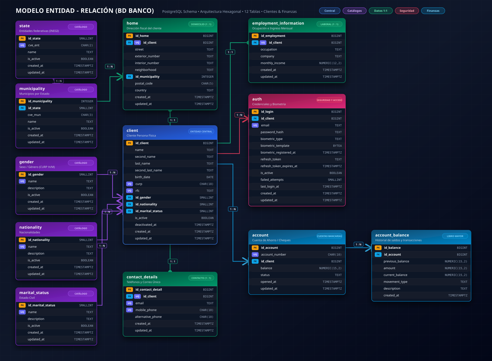
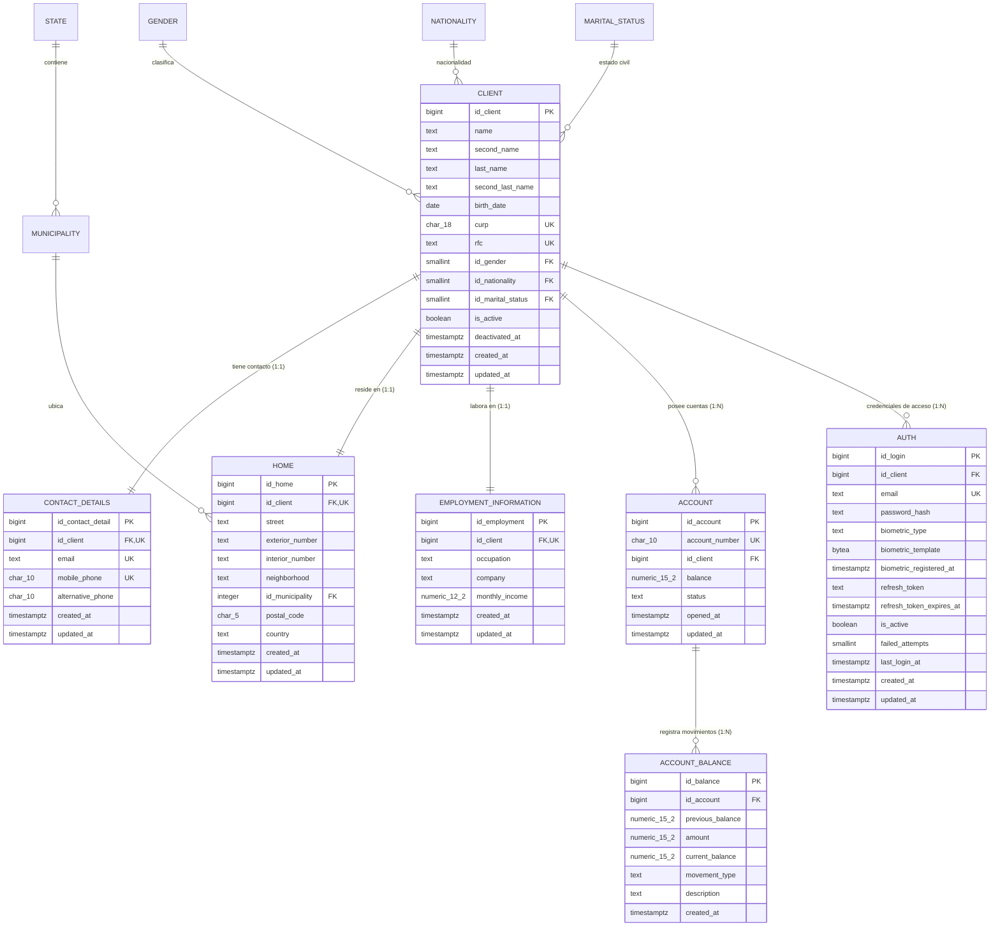
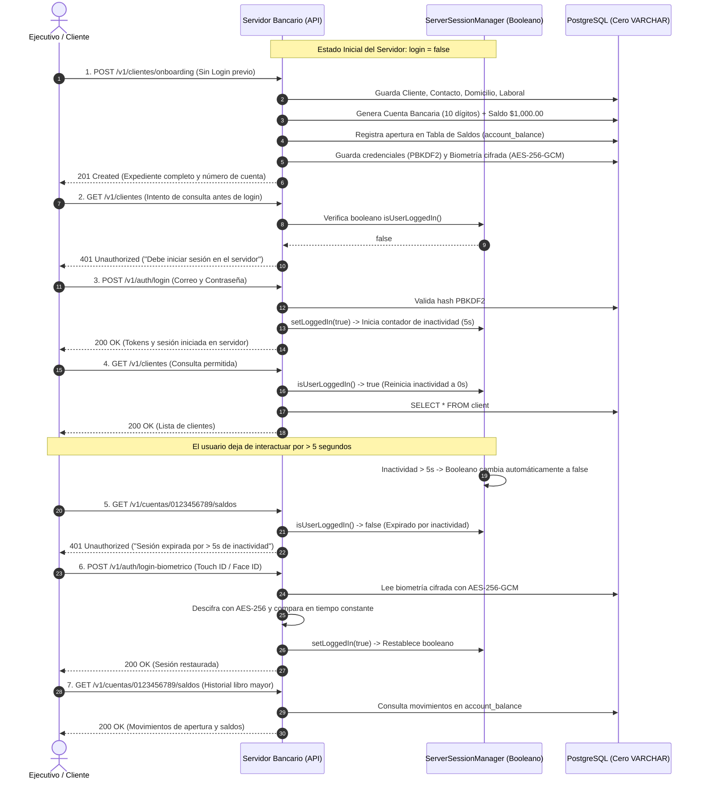

# 🏦 Sistema Bancario - Onboarding de Clientes Personas Físicas

Aplicación bancaria empresarial desarrollada en **Java 21** con **Spring Boot 3.5**, **Spring Data JPA**, **Flyway**, **PostgreSQL** y arquitectura limpia. Diseñada para registrar clientes personas físicas, validar de forma estricta sus datos de identidad, crear automáticamente una cuenta bancaria con saldo inicial asignado, auditar la tabla de saldos, proteger los datos biométricos con cifrado **AES-256-GCM** y controlar el acceso mediante un **booleano en el servidor con temporizador de inactividad de 5 segundos**.

---

## 📋 Índice
1. [Objetivo y Arquitectura](#-objetivo-y-arquitectura)
2. [Diseño de Base de Datos (Cero VARCHAR)](#-diseño-de-base-de-datos-cero-varchar)
3. [Diagrama Entidad-Relación (ER)](#-diagrama-entidad-relación-er)
4. [Seguridad y Cifrado de Información](#-seguridad-y-cifrado-de-información)
5. [Control del Servidor: Booleano de Login y Contador de 5s de Inactividad](#-control-del-servidor-booleano-de-login-y-contador-de-5s-de-inactividad)
6. [Flujo Integral Paso a Paso de la Aplicación](#-flujo-integral-paso-a-paso-de-la-aplicación)
7. [Catálogo Completo de Endpoints y Payloads JSON](#-catálogo-completo-de-endpoints-y-payloads-json)
8. [Matriz de Reglas de Negocio y Validaciones](#-matriz-de-reglas-de-negocio-y-validaciones)
9. [Instrucciones de Ejecución y Pruebas](#-instrucciones-de-ejecución-y-pruebas)

---

## 🎯 Objetivo y Arquitectura

El sistema automatiza el proceso de **Onboarding Bancario** para personas físicas, permitiendo a los ejecutivos de la institución financiera dar de alta clientes con validaciones oficiales (CURP, RFC, mayoría de edad, código postal de 5 dígitos, teléfonos a 10 dígitos y correos electrónicos normalizados).

### Componentes Principales:
* **Entidades de Dominio:** `Client`, `ContactDetail`, `Home`, `EmploymentInformation`, `Account`, `AccountBalance`, `Auth` y catálogos geográficos/demográficos.
* **Persistencia Robusta:** Migraciones Flyway versionadas (V1 a V14), repositorios JPA y soporte para base de datos PostgreSQL.
* **Servicios de Negocio Transaccionales:** Separación de responsabilidades con validaciones de negocio en servicio y restricciones `CHECK` en base de datos.
* **API REST & OpenAPI:** Controladores RESTful documentados con Swagger UI interactivo en `/swagger-ui.html`.

---

## 🗄️ Diseño de Base de Datos (Cero VARCHAR)

Cumpliendo con la directiva estricta de **NO USAR `VARCHAR`**, la base de datos aprovecha de forma óptima los tipos de datos nativos de PostgreSQL para maximizar el rendimiento y el uso eficiente de memoria:

| Tipo Usado | Campos de Aplicación | Justificación Técnica |
| :--- | :--- | :--- |
| `TEXT` | Nombres, apellidos, colonias, calles, ocupación, empresa, emails, hashes | En PostgreSQL, `TEXT` y `VARCHAR` tienen el mismo almacenamiento interno (`varlena`), pero `TEXT` evita la penalización de reescritura de tabla en migraciones y se complementa con restricciones `CHECK` con expresiones regulares (Regex). |
| `CHAR(18)` | CURP | Clave de longitud estrictamente fija de 18 caracteres alfanuméricos. |
| `CHAR(10)` | Teléfonos y Número de Cuenta | Longitud fija exacta (10 dígitos). Almacenamiento directo sin overhead. |
| `CHAR(5)` | Código Postal | 5 dígitos exactos según norma de Correos de México. |
| `NUMERIC(15,2)` | Saldos y montos bancarios | Precisión exacta para cálculo monetario sin pérdidas de redondeo de punto flotante. |
| `BYTEA` | Plantillas biométricas | Almacena el vector/minutiae biométrico cifrado con **AES-256-GCM**. |
| `SMALLINT` | Catálogos (Género, Estado Civil, Nacionalidad) y fallos | Ocupa solo 2 bytes por registro. |
| `BOOLEAN` | `is_active` | Indicador booleano compacto para control de baja lógica. |
| `DATE` | `birth_date` | 4 bytes, soporte natural de cálculos cronológicos. |
| `TIMESTAMPTZ` | Fechas de auditoría (`created_at`, `updated_at`, etc.) | Fechas con zona horaria universal (UTC). |

---

## 📊 Diagrama Entidad-Relación (ER)

<p align="center">
  
</p>

> 📥 **Formatos disponibles para descarga y visualización:**
> * **Vectorial SVG:** [`modelo_entidad_relacion.svg`](./modelo_entidad_relacion.svg)
> * **Imagen PNG en Alta Resolución:** [`modelo_entidad_relacion.png`](./modelo_entidad_relacion.png)

<details>
<summary><b>Ver código fuente Mermaid del diagrama</b></summary>


</details>

---

## 🔒 Seguridad y Cifrado de Información

La aplicación cuenta con capas de protección criptográfica para garantizar confidencialidad, autenticidad y resiliencia:

1. **Tabla de Login y Contraseñas Cifradas:**
   * Las contraseñas nunca se guardan en texto plano. Se procesan con `PBKDF2WithHmacSHA256`, empleando **10,000 iteraciones**, clave de **256 bits** y un **salt criptográfico aleatorio único de 16 bytes** generado mediante `SecureRandom`.
   * Formato guardado: `iteraciones:salt_base64:hash_base64`.
   * Bloqueo automático de acceso tras 5 intentos fallidos consecutivos (`failed_attempts >= 5`).
2. **Cifrado Simétrico de Datos Biométricos (AES-256-GCM):**
   * El servicio `AesEncryptionService` cifra los vectores y plantillas biométricas (huella dactilar o reconocimiento facial) con **AES-256 en modo Galois/Counter Mode (GCM)** (`AES/GCM/NoPadding`).
   * Cada cifrado produce un Vector de Inicialización (IV) único de 96 bits y genera una etiqueta de autenticación (Tag) de 128 bits para impedir alteraciones o manipulaciones no autorizadas.
   * La validación biométrica se compara en **tiempo constante** (`MessageDigest.isEqual`) para mitigar ataques de canal lateral (*timing attacks*).
3. **Tabla de Saldos y Auditoría Bancaria (`account_balance`):**
   * Cada apertura de cuenta, depósito o ajuste genera un registro inmutable en la tabla de saldos con el saldo anterior, el monto, el saldo resultante y la descripción.
4. **Protección de Tokens:**
   * Emisión de Access Tokens JWT firmados con clave HMAC-SHA256 y rotación automática de Refresh Tokens.

---

## ⏱️ Control del Servidor: Booleano de Login y Contador de 5s de Inactividad

Para cumplir con el requerimiento de control de acceso dinámico en el servidor:

### 1. El Booleano en el Servidor (`isLoggedIn`):
* El servidor mantiene un componente `ServerSessionManager` con un booleano en memoria (`AtomicBoolean loggedIn`).
* **Operaciones sin sesión (Públicas):** La **creación de cuentas**, el **onboarding integral**, el inicio de sesión (`/v1/auth/login`) y la consulta de catálogos están abiertas y se pueden ejecutar sin haber iniciado sesión.
* **Operaciones que requieren sesión (Protegidas):** Todas las **consultas de clientes** (`GET /v1/clientes/**`), **consultas de cuentas** (`GET /v1/cuentas/**`), balances y modificaciones requieren que el booleano en el servidor sea `true`.

### 2. Contador de Inactividad de 5 Segundos:
* En cuanto el usuario inicia sesión (`POST /v1/auth/login` o `POST /v1/auth/login-biometrico`), el servidor establece `login = true` y reinicia el reloj de inactividad.
* Si transcurren **más de 5 segundos de inactividad** (sin peticiones del usuario), el servidor **pasa automáticamente el booleano a `false`** y expira la sesión.
* Cada consulta u operación exitosa **reinicia automáticamente el temporizador a 0 segundos**, permitiendo continuar navegando.
* Si la sesión expiró por superar los 5 segundos de inactividad, cualquier intento de consulta devolverá inmediatamente:
  ```json
  {
    "timestamp": "2026-09-26T18:30:00Z",
    "status": 401,
    "error": "Acceso No Autorizado (Sesión Inactiva)",
    "message": "Operación restringida: Para realizar consultas en el servidor, debe iniciar sesión (login = true). Si ya había iniciado sesión, esta expiró automáticamente tras 5 segundos de inactividad.",
    "path": "/v1/clientes",
    "inactivityLimitSeconds": 5
  }
  ```
* Se puede monitorear en tiempo real el estado del booleano, los segundos transcurridos y los segundos restantes con el endpoint:  
  `GET /v1/auth/session-status`

---

## 🚀 Flujo Integral Paso a Paso de la Aplicación

A continuación se muestra el ciclo de vida completo de interacción con el sistema bancario:



---

## 📡 Catálogo Completo de Endpoints y Payloads JSON

### 1. Autenticación y Estado del Servidor

#### A. Consultar Estado del Booleano del Servidor y Temporizador de Inactividad
* **Método:** `GET`
* **Ruta:** `/v1/auth/session-status` (o `/v1/auth/estado-servidor`)
* **Acceso:** Libre (Sin login)
* **Respuesta Exitosa (200 OK - Activo):**
```json
{
  "isLoggedIn": true,
  "inactivitySeconds": 2,
  "maxInactivitySeconds": 5,
  "remainingSeconds": 3,
  "userEmail": "roberto.hernandez@correo.com",
  "clientId": 1,
  "status": "ACTIVA",
  "lastActivityAt": "2026-09-26T18:40:10Z",
  "message": "Sesión iniciada en el servidor (login = true). Inactividad: 2s / Límite: 5s."
}
```
* **Respuesta Exitosa (200 OK - Expirado por 5s de Inactividad):**
```json
{
  "isLoggedIn": false,
  "inactivitySeconds": 7,
  "maxInactivitySeconds": 5,
  "remainingSeconds": 0,
  "userEmail": null,
  "clientId": null,
  "status": "EXPIRADA_POR_INACTIVIDAD",
  "lastActivityAt": null,
  "message": "Sesión expirada tras 7 segundos de inactividad (límite: 5s). Inicie sesión para realizar consultas."
}
```

---

#### B. Inicio de Sesión Tradicional (Email y Contraseña)
* **Método:** `POST`
* **Ruta:** `/v1/auth/login`
* **Acceso:** Libre (Sin login previo)
* **Cuerpo de la Petición (`application/json`):**
```json
{
  "email": "roberto.hernandez@correo.com",
  "password": "Password123#_"
}
```
* **Respuesta Exitosa (200 OK):**
```json
{
  "token": "eyJhbGciOiJIUzI1NiJ9...",
  "refreshToken": "d7a8e2f14c2b480bb123456789abcdef",
  "tokenType": "Bearer",
  "expiresIn": 3600,
  "idClient": 1,
  "email": "roberto.hernandez@correo.com",
  "isActive": true,
  "hasBiometricRegistered": true,
  "biometricType": "HUELLA"
}
```

---

#### C. Inicio de Sesión Biométrico (Huella / Rostro)
* **Método:** `POST`
* **Ruta:** `/v1/auth/login-biometrico`
* **Acceso:** Libre (Sin login previo)
* **Cuerpo de la Petición (`application/json`):**
```json
{
  "email": "roberto.hernandez@correo.com",
  "biometricType": "HUELLA",
  "biometricData": "dmVjdG9yLWh1ZWxsYS1kaWdpdGFsLXBydWViYS0xMjM=",
  "deviceId": "Pixel-8-Pro-Fingerprint"
}
```
* **Respuesta Exitosa (200 OK):**
*(Devuelve tokens JWT y pone el booleano del servidor en `true`).*

---

#### D. Cierre de Sesión (Logout)
* **Método:** `POST`
* **Ruta:** `/v1/auth/logout?email=roberto.hernandez@correo.com`
* **Acceso:** Libre
* **Efecto:** Revoca el Refresh Token en BD y cambia el booleano del servidor a `false`.
* **Respuesta Exitosa (204 No Content)**

---

### 2. Onboarding y Clientes

#### A. Proceso Integral de Onboarding (Creación de Cuenta Automática y Biometría)
* **Método:** `POST`
* **Ruta:** `/v1/clientes/onboarding`
* **Acceso:** **Libre (No requiere haber iniciado sesión)**
* **Cuerpo de la Petición (`application/json`):**
```json
{
  "name": "Roberto",
  "secondName": "Carlos",
  "lastName": "Hernández",
  "secondLastName": "Gómez",
  "birthDate": "1995-08-15",
  "curp": "HEGR950815HDFRMN08",
  "rfc": "HEGR950815AB1",
  "idGender": 1,
  "idNationality": 1,
  "idMaritalStatus": 1,
  "email": "roberto.hernandez@correo.com",
  "mobilePhone": "5512345678",
  "alternativePhone": "5587654321",
  "street": "Avenida Insurgentes Sur",
  "exteriorNumber": "1602",
  "interiorNumber": "Piso 4 Depto 401",
  "neighborhood": "Crédito Constructor",
  "idMunicipality": 1,
  "postalCode": "03940",
  "country": "México",
  "occupation": "Ingeniero de Software",
  "company": "Tech Solutions México",
  "monthlyIncome": 45000.00,
  "initialBalance": 1000.00,
  "password": "Password123#_",
  "biometricType": "HUELLA",
  "biometricData": "dmVjdG9yLWh1ZWxsYS1kaWdpdGFsLXBydWViYS0xMjM="
}
```
* **Respuesta Exitosa (201 Created):**
```json
{
  "client": {
    "idClient": 1,
    "name": "Roberto",
    "secondName": "Carlos",
    "lastName": "Hernández",
    "secondLastName": "Gómez",
    "birthDate": "1995-08-15",
    "curp": "HEGR950815HDFRMN08",
    "rfc": "HEGR950815AB1",
    "idGender": 1,
    "idNationality": 1,
    "idMaritalStatus": 1,
    "isActive": true,
    "createdAt": "2026-09-26T18:25:00Z",
    "updatedAt": "2026-09-26T18:25:00Z"
  },
  "contactDetail": {
    "idContactDetail": 1,
    "idClient": 1,
    "email": "roberto.hernandez@correo.com",
    "mobilePhone": "5512345678",
    "alternativePhone": "5587654321"
  },
  "home": {
    "idHome": 1,
    "idClient": 1,
    "street": "Avenida Insurgentes Sur",
    "exteriorNumber": "1602",
    "interiorNumber": "Piso 4 Depto 401",
    "neighborhood": "Crédito Constructor",
    "idMunicipality": 1,
    "postalCode": "03940",
    "country": "México"
  },
  "employmentInformation": {
    "idEmployment": 1,
    "idClient": 1,
    "occupation": "Ingeniero de Software",
    "company": "Tech Solutions México",
    "monthlyIncome": 45000.00
  },
  "primaryAccount": {
    "idAccount": 1,
    "accountNumber": "9482015632",
    "idClient": 1,
    "balance": 1000.00,
    "status": "ACTIVA",
    "openedAt": "2026-09-26T18:25:00Z",
    "updatedAt": "2026-09-26T18:25:00Z"
  },
  "accounts": [
    {
      "idAccount": 1,
      "accountNumber": "9482015632",
      "idClient": 1,
      "balance": 1000.00,
      "status": "ACTIVA",
      "openedAt": "2026-09-26T18:25:00Z",
      "updatedAt": "2026-09-26T18:25:00Z"
    }
  ],
  "auth": {
    "idClient": 1,
    "email": "roberto.hernandez@correo.com",
    "isActive": true,
    "hasBiometricRegistered": true,
    "biometricType": "HUELLA"
  }
}
```

---

#### B. Consultas de Clientes (Requieren Sesión Activa en el Servidor)
* **Consultar todos:** `GET /v1/clientes`
* **Consultar por ID:** `GET /v1/clientes/1`
* **Consultar detalle integral:** `GET /v1/clientes/1/detalle`
* **Consultar por CURP:** `GET /v1/clientes/curp/HEGR950815HDFRMN08` (o `GET /v1/clientes?curp=HEGR950815HDFRMN08`)
* **Consultar por RFC:** `GET /v1/clientes/rfc/HEGR950815AB1` (o `GET /v1/clientes?rfc=HEGR950815AB1`)
* **Consultar por Correo:** `GET /v1/clientes/correo/roberto.hernandez@correo.com` (o `GET /v1/clientes?email=roberto.hernandez@correo.com`)
* **Consultar por Número de Cuenta:** `GET /v1/clientes/cuenta/9482015632` (o `GET /v1/clientes?numeroCuenta=9482015632`)
* **Consultar Clientes Activos:** `GET /v1/clientes/activos` (o `GET /v1/clientes?activo=true`)
* **Consultar por Rango de Fechas:** `GET /v1/clientes/rango-fechas?desde=2026-01-01T00:00:00Z&hasta=2026-12-31T23:59:59Z`

---

#### C. Actualización de Información (PUT / PATCH)
* **Regla estricta:** **NO** se permite modificar `curp` ni `rfc`. Si se envían modificados, el sistema rechaza la petición con código HTTP `422 Unprocessable Entity`.
* **Reemplazo Completo (`PUT /v1/clientes/1`):**
```json
{
  "name": "Roberto",
  "secondName": "Carlos",
  "lastName": "Hernández",
  "secondLastName": "Gómez",
  "birthDate": "1995-08-15",
  "curp": "HEGR950815HDFRMN08",
  "rfc": "HEGR950815AB1",
  "idGender": 1,
  "idNationality": 1,
  "idMaritalStatus": 2
}
```
* **Actualización Parcial (`PATCH /v1/clientes/1`):**
```json
{
  "secondName": "Antonio",
  "idMaritalStatus": 2
}
```

---

#### D. Baja Lógica de Cliente (DELETE)
* **Método:** `DELETE`
* **Ruta:** `/v1/clientes/1`
* **Acceso:** Requiere sesión
* **Efecto:**
  1. `client.is_active` pasa a `false` y se registra `deactivated_at = now()`.
  2. Todas sus cuentas bancarias asociadas pasan a estatus `'INACTIVA'`.
  3. Sus credenciales de acceso pasan a `is_active = false` y se revoca cualquier Refresh Token.
  4. La información física **permanece íntegra** en base de datos.
* **Respuesta Exitosa:** `204 No Content`.

---

### 3. Cuentas Bancarias y Tabla de Saldos

#### A. Consultar Cuenta por Número
* **Método:** `GET`
* **Ruta:** `/v1/cuentas/9482015632`
* **Respuesta (200 OK):**
```json
{
  "idAccount": 1,
  "accountNumber": "9482015632",
  "idClient": 1,
  "balance": 1000.00,
  "status": "ACTIVA",
  "openedAt": "2026-09-26T18:25:00Z",
  "updatedAt": "2026-09-26T18:25:00Z"
}
```

---

#### B. Consultar Saldo de la Cuenta
* **Método:** `GET`
* **Ruta:** `/v1/cuentas/9482015632/saldo`
* **Respuesta (200 OK):**
```json
{
  "accountNumber": "9482015632",
  "balance": 1000.00,
  "status": "ACTIVA"
}
```

---

#### C. Consultar Historial en la Tabla de Saldos (`account_balance` - Libro Mayor)
* **Método:** `GET`
* **Ruta:** `/v1/cuentas/9482015632/saldos` (o `/v1/cuentas/9482015632/movimientos`)
* **Respuesta (200 OK):**
```json
[
  {
    "idBalance": 1,
    "idAccount": 1,
    "accountNumber": "9482015632",
    "previousBalance": 0.00,
    "amount": 1000.00,
    "currentBalance": 1000.00,
    "movementType": "APERTURA",
    "description": "Apertura de cuenta con asignación de saldo inicial de bienvenida",
    "createdAt": "2026-09-26T18:25:00Z"
  }
]
```

---

#### D. Consultar Cuentas Activas
* **Método:** `GET`
* **Ruta:** `/v1/cuentas/activas`

---

## 🛡️ Matriz de Reglas de Negocio y Validaciones

| Campo / Regla | Restricción | Expresión Regular / Validación | Excepción / Código HTTP |
| :--- | :--- | :--- | :--- |
| **Nombre y Apellidos** | Obligatorios, solo letras y espacios, 2-50 caracteres | `^[A-Za-zÁÉÍÓÚÜÑáéíóúüñ ]{2,50}$` | `MethodArgumentNotValidException` (400) |
| **CURP** | 18 caracteres alfanuméricos, formato oficial RENAPO, Único | `^[A-Z]{4}[0-9]{6}[HM][A-Z]{2}[B-DF-HJ-NP-TV-Z]{3}[A-Z0-9][0-9]$` | `CurpDuplicatedException` (409) / 400 |
| **RFC** | 12 o 13 caracteres formato SAT, Único | `^[A-ZÑ&]{3,4}[0-9]{6}[A-Z0-9]{3}$` | `RfcDuplicatedException` (409) / 400 |
| **Mayoría de Edad** | >= 18 años cumplidos a la fecha actual, no fecha futura | `Period.between(birthDate, now).getYears() >= 18` | `BusinessValidationException` (422/400) |
| **Correo Electrónico** | Formato de email válido, máx 100 caracteres, Único | `^[A-Za-z0-9._%+-]+@[A-Za-z0-9.-]+\.[A-Za-z]{2,}$` | `EmailDuplicatedException` (409) / 400 |
| **Teléfono Móvil** | Exactamente 10 dígitos numéricos, Único | `^[0-9]{10}$` | `PhoneDuplicatedException` (409) / 400 |
| **Código Postal** | Exactamente 5 dígitos numéricos | `^[0-9]{5}$` | `MethodArgumentNotValidException` (400) |
| **Ingreso Mensual** | Debe ser mayor a 0 | `monthlyIncome > 0` | `BusinessValidationException` (422) |
| **Saldo Inicial** | No puede ser negativo | `initialBalance >= 0` | `BusinessValidationException` (422) |
| **Número de Cuenta** | Único, 10 dígitos autogenerados aleatoriamente | `^[0-9]{10}$` | Manejo automático en servicio |
| **Clientes Inactivos** | No pueden abrir ni tener cuentas activas | `client.isActive == true` | `ClientInactiveException` (400) |
| **Inmutabilidad** | Prohibido modificar CURP, RFC o Cuenta bancaria | Validación en `ClientServiceImpl` | `BusinessValidationException` (422) |
| **Sesión Servidor** | Booleano `login = true` con 5s inactividad para consultas | `ServerSessionInterceptor` | `401 Unauthorized` |

---

## 💻 Instrucciones de Ejecución y Pruebas

### Requisitos Previos:
* **Java 21 (JDK 21)** instalado y configurado en el `PATH`.
* **PostgreSQL 14+** corriendo en `localhost:5432` con base de datos `banco` (o configurar credenciales en `application.properties`).

### 1. Ejecutar la Aplicación:
```powershell
# En la raíz del proyecto:
.\gradlew bootRun
```
* La aplicación iniciará en `http://localhost:8080`.
* Flyway aplicará automáticamente las migraciones desde `V1` hasta `V14__create_account_balance_table.sql`.

### 2. Acceso a Swagger UI:
Abre tu navegador en:
```
http://localhost:8080/swagger-ui.html
```
Podrás probar de forma gráfica todos los endpoints, ver esquemas y modelos.

### 3. Ejecutar la Suite de Pruebas Unitarias Automatizadas:
```powershell
.\gradlew test --no-daemon
```
* Todas las pruebas unitarias de `AccountService`, `AuthService`, `AesEncryptionService`, `ServerSessionManager`, `ClientService` y `CatalogService` se ejecutan y validan en memoria con base de datos H2.

### 4. Prueba Rápida con cURL (Comprobando el Booleano y los 5 Segundos):

```bash
# 1. Registrar un cliente mediante Onboarding (PÚBLICO, sin sesión)
curl -X POST http://localhost:8080/v1/clientes/onboarding \
  -H "Content-Type: application/json" \
  -d '{"name":"Roberto","secondName":"Carlos","lastName":"Hernandez","secondLastName":"Gomez","birthDate":"1995-08-15","curp":"HEGR950815HDFRMN08","rfc":"HEGR950815AB1","idGender":1,"idNationality":1,"idMaritalStatus":1,"email":"roberto@correo.com","mobilePhone":"5512345678","street":"Insurgentes Sur","exteriorNumber":"1602","neighborhood":"Centro","idMunicipality":1,"postalCode":"03940","country":"México","occupation":"Ingeniero","company":"Empresa SA","monthlyIncome":35000.00,"initialBalance":1000.00,"password":"Password123#_"}'

# 2. Intentar consultar antes de login -> Devolverá 401 Unauthorized
curl -i http://localhost:8080/v1/clientes

# 3. Iniciar sesión -> Pone booleano en TRUE y arranca contador de inactividad
curl -X POST http://localhost:8080/v1/auth/login \
  -H "Content-Type: application/json" \
  -d '{"email":"roberto@correo.com","password":"Password123#_"}'

# 4. Consultar inmediatamente (< 5 segundos) -> Devolverá 200 OK y la lista
curl -i http://localhost:8080/v1/clientes

# 5. Esperar 6 segundos sin interactuar
# Al consultar de nuevo -> Devolverá 401 Unauthorized por haber expirado el tiempo de inactividad
curl -i http://localhost:8080/v1/clientes

# 6. Consultar estado del booleano del servidor
curl http://localhost:8080/v1/auth/session-status
```
